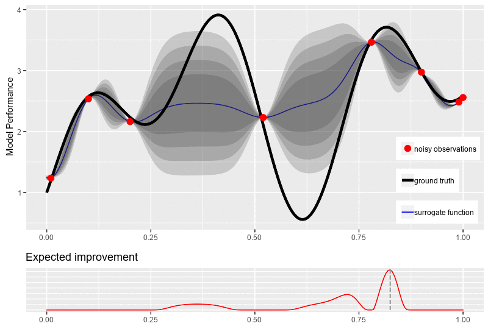

# Bayesian Optimization

A simple implementation code of [**Bayesian Optimization**](https://bayesoptbook.com) (BayesOpt) on NumPy and SciPy with Gaussian Process as the surrogate model and Expected Improvement as acquisition function for black-box optimization.

The main idea of the algorithm is to build a *statistical surrogate model* (distribution over function) and sample more data via a *cheap-optimized acquisition function* to update itself via Bayesian theorem, thus locating the global optimum of the black-box function.

Illustration of how BayesOpt works:

  
## Theoretical background
+ My [**blog**](https://quanghuy0497.github.io/mathematic/2022/12/10/bayesopt.html) about Bayesian Optimization
+ My [**slide**](https://github.com/quanghuy0497/Bayesian_Optimization/blob/main/slide.pdf) about Bayesian Optimization
